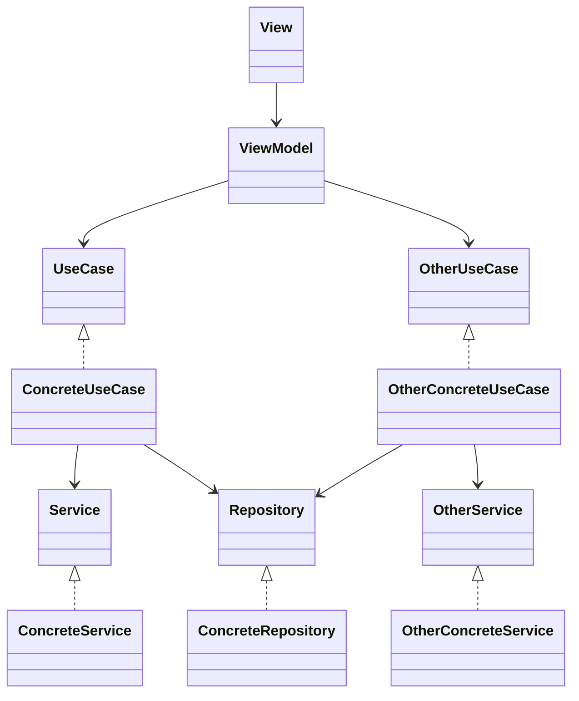

---
categories:
  -
comments: true
date: "2024-04-23T00:00:00Z"
summary: "I was surprised how much utilizing the UseCase pattern in my last Android app helped with the development. It naturally created a clear structure, created boundaries, and accidentally extracted the app domain. Maybe it will work for you too."
image: /assets/posts/usecases.png
tags:
  - Android
  - UseCase
  - design pattern
title: "Refactor to UseCases"
toc: true
url: 2024-04-23-refactor-to-usecases
---

## Extract Method

You know this basic refactoring technique, when you highlight a block of code and ask IDE to `extract method`? Or you do it manually, doesn't matter. The point is to have human-readable focused methods instead of long blocks of instructions. One problem you may create is that the extracted method is still using fields or other methods from your class. It's not [pure](https://en.wikipedia.org/wiki/Pure_function). It may be, but simple extraction won't do this.

Going one step further would be moving the code to a separate class. Now it has only data that you provided as an argument and can use only external dependencies that you explicitly allowed. It's called the `UseCase`. I used it in my last Android project and I was surprised at how much it helped us to organize the project, write small focused classes, and test everything easily.

## But better

I bet you already created countless `Handlers`, `Managers`, `Helpers`, etc. in your projects. You delegate parts of work there and hope that it will stand the test of time.
So what is `UseCase` promising that was not delivered by previously mentioned classes?

### Structure

UseCase is stateless by definition. It doesn't keep any data other than required to perform its task.
And it has a single task to perform.
After it's done - it's as good as dead.
Fire and forget.
Data is kept in local Repositories and/or backend services and it is fetched only when needed.
Those limitations actually help to create a simple, focused, and maintainable class.

> This pattern can be implemented in multiple ways, I will describe the one I personally used and enjoyed. It took a few iterations to get there, but what works for me may not work for you.

Each UseCase has a single purpose to exist (and it's not [passing butter](https://www.youtube.com/watch?v=3ht-ZyJOV2k)).
I like to utilize Kotlin `invoke` operator and pass all arguments there.
I'm aware that can be criticized because it can obfuscate information that it is a class, not a function.
But since I want to use the UseCase **as function** I think it works great here.
Knowing if it's a class and calling it's only method wouldn't necessarily give me any useful information.
Using `invoke` also makes me think about the purpose of the UseCase, having a standard method there could provoke adding "just another one" because of accidental similarity.

An instance of a UseCase is created with access to Services and Repositories used to perform its task. I'm also passing the dispatcher here, so I can overwrite it in tests.

Code example:

```Kotlin
interface ReadItemsUseCase {
    suspend operator fun invoke(): Result<Flow<List<Item>>>
}

class ReadItemsUseCaseImpl(
    private val itemsRepository: ItemsRepository,
    private val defaultDispatcher: CoroutineDispatcher = Dispatchers.Default
) : ReadItemsUseCase {
    override suspend fun invoke(): Result<Flow<List<Item>>> {
        return withContext(defaultDispatcher) {
            try {
                Result.success(itemsRepository.getItemsFlow())
            } catch (e: Exception) {
                Result.failure(DomainError.ErrorWhileReadingItems(e.message ?: "$e"))
            }
        }
    }
}
```

This UseCase is returning a flow of data from a repository. The return type is Kotlin `Result` which encapsulates a success response with data and a failure one with a Throwable error. Calling UseCase in the presentation layer (ViewModel in this case) looks like this:

```Kotlin
readItemsUseCase()
  .onSuccess { itemsFlow ->
    itemsFlow.collect { itemsUpdate ->
    // do something with the data
    }
  }
  .onFailure { error ->
    displayErrorMessage(error)
  }
```

Isn't it nice without any `try/catch`, with explicit error handling? Logging can also be done in a UseCase, so the presentation layer can focus on its sole purpose - presenting the UI.
UseCases shouldn't surprise you with throwing errors. Why should you know which one can throw? Or should you defensibly wrap every call in `try/catch`?

No.

Just **don't throw from UseCase**, ever. If it throws - that is an error to take care of, not one of the expected outcomes.
I had a strict "no try/catch in ViewModel" policy and it worked very well in my last project. At some point returning the `Result` felt a bit too limiting, with no way to return partial data with error for example. We've come up with our own `Outcome` class, that behaved similarly but with more glitter and sparkles. And bugs.
For whatever reason I was stubborn about `DomainError` to **NOT** extend the `Throwable`, probably to not be tempted to throw it. Eventually, I broke and it allowed easier analytics logging. And `Outcome` remained a bit overkill IMO. Lesson learned. Use pre-existing verified stuff. Use UseCases.

Let's say the UseCase modifies an item on the list. Should it return the updated item, so the calling site has to update the list, or rather return the whole updated list?

I'd say nighter.

The items list should be observed from another place, CQRS style.
That way a single source of truth exists, and a list modified from multiple sides remains updated for all observers.
I was extensible using `InMemoryRepository` for sharing such data between multiple ViewModels, handling parts of the same UI screen. When a list view was opened, data was loaded into the repository. UseCases were modifying it there, and observers were getting updates directly. UseCases were returning just `success/error` information but no data.

A typical Android application that utilizes UseCases can look like this on a diagram:



Or to put it on the clean code onion rings:

The point here is that you as the developer control **everything** inside the inner `domain` circle. Ideally, it won't depend on any external stuff. The further from the circle you go, the more constraints you get. The service communicating with the backend will need some HTTP client and you don't want to make one from scratch. The UI will depend on the platform it's built for, and you also don't want to draw everything pixel by pixel, you will use some framework. But the domain shall be left alone from those technical details. And UseCases helps with that.

> This worked nicely with the Android app, but may not be 1-to-1 applicable in other development setups.

Key definitions from the diagram:

- Service - the connecting point between your domain and the outside world. It can be used to make HTTP calls, but also handle Bluetooth connections, or handle notifications. Basically anything that is not part of your domain, but serves it.
  - Platform services - a specific kind of Service, used to abstract platform capabilities, like notifications, camera, and location.
- Repository - the place where data lives. Used to retrieve and persist it.
- UseCase - stateless single-purpose wrapper over part of the domain. Used by clients (like ViewModel) to provide functionality. Should use domain language rather than technical terms to specify responsibilities, so "AddToCartUseCase" rather than "SendHTTPRequestUseCase".
- Domain - app business logic, describes what app **actually** does. Your app is not making HTTP calls for the sake of making them, they are used to display a shopping list or allow users to buy something.
- Domain Error - context-based error type. When you get HTTP404 response status for a request to get a shopping list, it's nicer to return "ShopplingListNotFoundError" than generic "NotFound" and force clients (ViewModel) to figure out what it actually means. App analytics looks way cleaner, and UI texts can be easily mapped using just domain error type.

This a is pretty high overview. But it should be enough to understand the place and the reason for having a UseCase.

> Reusability in Software Engineering is an overhyped myth.

You shouldn't extract logic into methods or classes only when you reuse them, or think you will (YAGNI). Extracting code increases readability and reduces cognitive load when navigating through code. It gives you the structure to fill the logic into without thinking too much about it. Have you ever had a problem like: "How to name this, is it more a `manager` or a `handler`?"

**It is a UseCase, it returns a `Result` that can be a `success` with data or a `failure` with error. And that's all you need to know.**

Oh did I mention that a UseCase can call other UseCases, just like a method can call other methods? :)
Think about it, you will have your domain logic packed in nicely encapsulated blocks. After a while, adding a new feature will be more like composing it from already existing parts rather than writing completely new. Or just fill in the missing part without touching what already exists. And this is good. Of course, this creates a dependency between UseCases, so I suggest doing it where it makes sense, and not splitting logic too granularly too soon. From my experience, it's better to start with one big UseCase, and split it into smaller pieces after a while, when it gets too chunky. There is some cost of using this structure after all.

### Boilerplate

Each UseCase has a similar structure. In my case, there is an interface with a single method, usually one implementation of it. And often the UseCase doesn't do all that much, becoming a bloated proxy for Repository calls, without any error handling or logging. I have to confess I was sometimes omitting the UseCase, and just calling Repositories directly from ViewModel. It didn't feel great, but writing a glorified proxy class didn't either. When calling the repo in VM was extended with some error handling etc. then it was a clear candidate to create a UseCase. Would I suggest to **always** create UC?

Kinda.

It provides you another area to hide logging, make better error handling, and write tests.

Sometimes it feels like a useless layer, but keeping a consistent structure in the project is just too damn important.
Having a rule to always create a UseCase, and make it the only way ViewModel performs its tasks, releases you from making a decision: should I add UseCase or not? Just add it, and focus on how it should work there.

There is a proverb in the EDC (Everyday Carry) community "Carry what you need, need what you carry".
It may seem that UseCase will be an overkill to perform some simple task, a single method call.
But just keeping project structure consistent, and not making decisions like "Is this logic worthy of separate class" is a valid reason for me.
Same time, producing millions of UseCases for every single thing is way too granular. Keep it sane, stupid. And use modules to keep similar stuff together.

### Testing

Because everything is using interfaces, it's very easy to test in isolation.
UseCase has a single job to perform, so writing a test with a happy path, and mocking those few dependencies shouldn't be that hard. We didn't even use the DI framework in the tests, just passed dependencies in the constructor, because it was easier and good enough :)

> Easy testing triggers better test cases.

Since you are not fatigued after testing a happy path, you can test for various edge cases and improve error handling. I think I added most of the `DomainErrors` when writing tests. It's not that I didn't think about it when writing code, but switching the hat to writing tests does something to my brain. The same goes for writing text, there is a phase of writing your thoughts and a phase of editing. Mixing both at the same time slows you down and corrupts the result. You can also start with tests if you like TDD, nobody is checking that.

We ended up having all UseCases tested, and most of ViewModels too. For the latter, we were not even mocking the UseCases, but Services and Repos used by UseCases, so we could test more with a single test case. We didn't need to use Android Framework for it so they were fast and simple to setup.

## Accidental Domain

By extracting business logic from ViewModels to UseCases, using Service interfaces and Repositories, we accidentally found our project `Domain`.

I know that by the book it should be the other way around but well... at least we've got it now :)
We had pure Kotlin code there, without any external dependencies. It was very visible when you imported code from another package, easy to track during PR, or even by some linting tools. Android framework (we used Bluetooth and storage for example) was abstracted out of the domain. The implementation was in dedicated services, so domain UseCases could focus on just performing business tasks.

This project was rather small, and we kept everything in a single module, just using packages (directory structure) to gather similar UseCases. Was good enough, but if we ever want to split it into multiple modules it should be easy, because of no external dependencies. We had ~60 DomainErrors, 12 Repositories, ~6 Services, and ~50 UseCases. UseCases were all less than 150 LoC, but usually way smaller.

> So if your project doesn't have a clear domain, you may just find it when you extract parts of logic into UseCases, and keep them pure from external dependencies.

## Summary

The first time I heard about the `UseCase` pattern I was not convinced.
It looked weird and so different from how I was used to writing code.
But I've given it a try and boy did I like it.
Using this structure is so easy to understand.
The borders between layers and classes are clear and hard to get wrong.
UseCases encourages writing smaller testable pieces of reusable code, promoting composition and context-based error handling.
Adopting UseCases allowed my team to be more predictable.
Even big and complex tasks were organically split into smaller independent pieces. We could safely merge unfinished features, with stubbed data for development, and feature flags hiding features from users. You can do it without a UseCase too, but having it makes finding usages a piece of cake.
We rarely interfered with each other, and no merge conflicts, or sync over some changes in a common module or inside `HandleItAllHandlerManager`. Everything was nicely tested, and testing wasn't a chore.

So next time you think about extracting some code, maybe move it to a new class.
Make it return a `Result`.
Make it stateless, cut dependencies, and pass the minimum required data.
Start composing your app with those.

Thank me later.

---

My UseCase:

- use `invoke` because they are single-purposed
- return `Result` for nice error handling without throwing
- utilize `DomainErrors` for context-specific error information
- is stateless, required data is fetched when needed, can exist in a single instance
- arguments are passed only in the `invoke` method

I did put together sample project that uses this approach: [Github Project](https://github.com/asvid/mv-whatever/tree/main/UseCaseExample) . It is literally a copy from my MVVM project used [in another post](https://swiderski.tech/2024-02-09-MVVM/), where the `Model` was split into separate UseCases. Enjoy!
