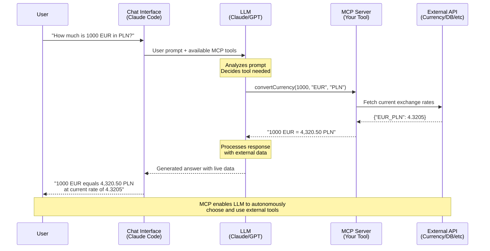
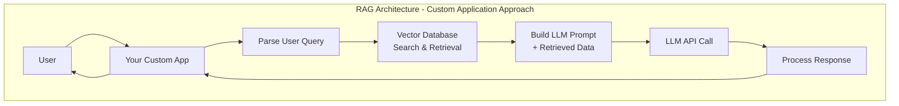
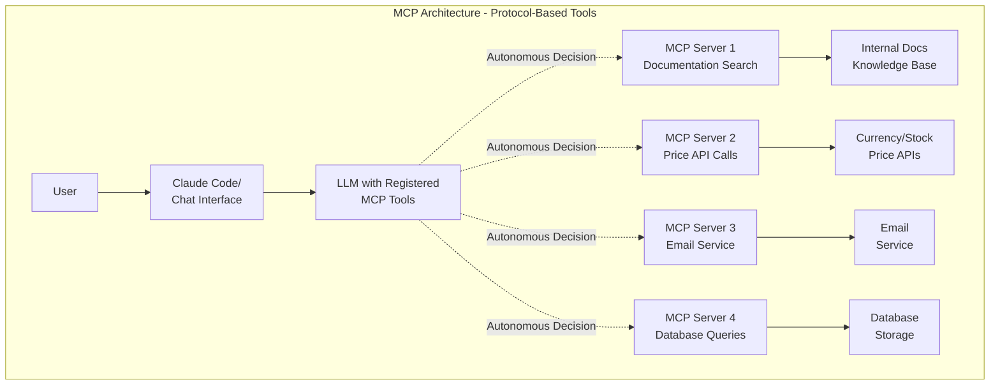

---
categories:
  -
comments: true
date: "2025-09-02T00:00:00Z"
description: "We've been thinking about AI development backwards. Instead of building \"AI-powered\" apps, we should be building tools that power AI. The Model Context Protocol lets you create small, focused tools that LLMs can use autonomously - just like Unix commands from 1978, but orchestrated by Claude instead of bash. I built a currency converter tool and watched an LLM decide when to use it, extract dates from user prompts, and combine multiple API calls without me writing any of that logic. It's the same composable philosophy that made Unix great, applied to making AI actually useful in the real world."
image: /assets/posts/mcp/mcp_post_img.jpg
tags:
  - ai
  - mcp
  - llm
  - claude
title: "The Unix Philosophy Meets AI: Building Composable LLM Tools with MCP"
toc: true
url: 2025-09-02-mcp-tools-llm-meets-unix
---


The potential of LLM's capabilities is still being explored and expanded. Instances of hallucinations and odd responses, often followed by a polite 'let me try again', are becoming increasingly rare with each model version. Context windows are expanding, and with innovative methods to compress ongoing conversations, the size of the context window is becoming less of a concern. However, a significant limitation remains: model knowledge. It's trained on data; it doesn't inherently 'know' data.

LLM knows as much as you provide it in the context window; everything else is tokens generated in the statistically most probable order. If you ask an AI-powered chat of your choice about last night's football game, it will know as much as I, and may even go into faking a conversation about this ludicrous display, what was Wenger thinking letting Walcott go so early? [(IT crowd reference)](https://www.youtube.com/watch?v=6yN2H3--1aw).

As I write it (31.08.2025), Claude and ChatGPT can search for additional information on the internet, parse it, and respond. However, there is no direct control over what they use for search, the results they receive, or whether they can identify fake news, so I would be cautious about the responses. You may not want to make share buy/sell decisions based on that.

You can always copy-paste information into the chat window and ask LLM to use that to generate a response like a troglodyte.

We, intellectuals, use MCP. You may pretend to be one after reading this post.

## Model Context Protocol

Anthropic (who gave us Claude) identified the issue with providing valuable data in context and proposed a protocol, allowing LLM to utilize the provided tools independently. Someone has to create those tools, and I will show you how in a sec, but LLM will decide when and how to use them.

So the idea looks like this:
- user talks with chat, this is the entry point
- chat using LLM has some external tools registered, called the MCP servers
- LLM decides that the user prompt needs additional information that can be provided by one of the registered tools
- The tool is called, responds with data, and LLM processes it
- user gets an answer generated by LLM with additional external data



MCP has 3 main pillars:

1. **Tools** - Functions LLM can execute on demand
    - `convertCurrency(1000, "EUR", "PLN")` - gets live exchange rates
    - `queryDatabase("SELECT * FROM users WHERE...")` - runs SQL queries - please don't do this, this is just a bad example
    - `sendEmail(to, subject, body)` - sends actual emails

1. **Resources** - Data LLM can read when needed
    - `currency-rates-history` - historical exchange rate data
    - `company-documentation` - your internal wiki/docs
    - `project-files` - current codebase or file contents
    - This is where your old RAG can get new life (get it? old rag? I'll see myself out)

3. **Prompts** - Templates that guide LLM reasoning
    - `sequential-thinking` - breaks complex problems into steps
    - `code-reviewer` - systematic code analysis framework
    - `research-assistant` - structured information gathering process

Each MCP service can implement those, provide a description, and hope that the LLM will select one of them to use. Existing MCP servers range from local tools that perform Git operations, to advanced and specialized web search (such as mentioned whitepapers), and up to API adapters for existing apps like Todoist. Yup, you can tell Claude to add tasks to a project, and it will do that. And it works better than Siri, but that bar was not very high...

MCP is implemented by Claude (duh), Gemini, and OpenAI, but I will use Claude Code for examples, as I personally use that.

## What happened with RAGs?

> RAG - **Retrieval Augmented Generation**.

They still have their place; nothing has changed, TBH. However, there is a key difference to understand between these two ways of enriching the LLM context.

RAG is a way to enrich context within the service that you build. The entry point is your app, which then hits LLM with additional data pulled from internal DB (or wherever your case may be). The responsibility of providing the correct data falls on you. So, you have to prepare the database, parse the user prompt to find fitting data, put that in the LLM prompt, and then send it via API to get the response. Then, parse it.



MCP is a protocol that enables LLM to select the appropriate tool and ultimately the data for the task. The entry point is the LLM in the form of chat. So when using Claude Code for... well code, I can add tools to read the documentation of the framework or library I use to reduce imaginary method calls (I had many of those when using Cursor). RAG won't help me here, because I don't want to create my own whole tool for generating code, same reason why I won't build my own cryptographic security - it's already done by people way smarter than me.

If you already have a RAG tool and would like to use it in generic chat... well, wrap it with MCP :)

Let's say you want to:
1. Look through internal documentation
2. Make an API call to check current prices
3. Send email
4. Save results to DB

RAG will cover just the 1st point; the rest can be done with MCP. The whole procedure can be done using AI Agents (topic for another post) that will use MCP tools, and wrapped in a single command you trigger from Claude Code.

It's like CI/CD with plug'n'play extensions, but not for running tests of your apps; it can be used for much more than code.

When using MCPs, your mindset needs to shift from building AI-powered tools (custom service with RAG) to directly providing tools for LLMs.



## Let's build something

Like the MCP tool for currency conversion, this data changes daily, so LLM can't be trained on it. There are free APIs available to obtain the data; free is a decent price.

The insanely overengineered architecture for this sample project looks like this:

```text
┌─────────────┐    ┌─────────────┐    ┌─────────────┐
│   Claude    │◄──►│ MCP Server  │◄──►│ Exchange    │
│   (Agent)   │    │ (Kotlin)    │    │ Rate API    │
└─────────────┘    └─────────────┘    └─────────────┘
```
And an example scenario I'd like to cover:

```
User: "How much is 1000 EUR in PLN?"
↓
Claude calls: convertCurrency(1000, "EUR", "PLN")
↓ 
MCP Server calls API
↓
Returns: "1000 EUR = 4,320.50 PLN (rate: 4.3205)"
```
Easy. But with a minor change to the MCP tool, which would require a date parameter, the same LLM and MCP can handle a case like this user prompt:
```
User: "So I got 1423 USD last Christmas, and I wonder if it was better to exchange it then or today?"
```
LLM will extract dates from the prompt, call MCP with those dates, and compare the responses. I didn't consider that use case when creating the currency conversion tool, but an LLM can figure out how to utilize the tool in a new way.

**THIS is the true power of MCP**

### Implementation details

I've been calling it `MCP server` for a reason. This is the main part of the tool:
```kotlin
val server = Server(  
    serverInfo = Implementation(  
        name = "smart-currency-assistant", version = "1.0.0"  
    ), options = ServerOptions(  
        capabilities = ServerCapabilities(  
            tools = ServerCapabilities.Tools(  
                listChanged = true,  
            ), prompts = ServerCapabilities.Prompts(  
                listChanged = true,  
            ), resources = ServerCapabilities.Resources(  
                listChanged = true, subscribe = false  
            ), logging = null // does nothing, but the MCP inspector won't work without it  
        )  
    )  
)
```
This is where the name, version, and capabilities are defined.

Having that, tools, prompts, and resources can be added:
```kotlin
server.addTool(  
    name = "hello", description = "Returns a simple greeting message", inputSchema = Tool.Input()  
) { _ ->  
    CallToolResult(content = listOf(TextContent("Hello from Currency Assistant MCP Server!")))  
}
```
The description is the key for LLM to use the tool. Maybe...use LLM to help you write a concise but descriptive one :)

Here's an extended explanation of MCP transport layers with practical context:

### Communication with LLM

**MCP server can be accessed in 3 ways by LLM:**

**1. STDIO (Standard Input/Output)**

**How it works**: Your MCP runs as a subprocess, communicating through stdin/stdout pipes.

```bash
# LLM client starts your process like this:
java -jar currency-mcp.jar
# Then sends JSON-RPC messages via stdin, receives responses via stdout
```

**Best for**:

- Local development and testing
- Simple deployment (just a JAR file, or something less insane)
- Desktop applications like Claude Code

**Pros**: Simple, no network setup, direct process control
**Cons**: Single client only, process must stay running, harder to debug

**2. SSE (Server-Sent Events)**

**How it works**: Your MCP runs as an HTTP server, and the client connects via the EventSource API for real-time updates.

```kotlin
// Your MCP server listens on HTTP port
embeddedServer(CIO, host = "localhost", port = 3000) {
    mcp { return@mcp configureServer() }
}.start()
```

**Best for**:

- Development with MCP Inspector
- Multiple clients connecting to the same MCP
- Real-time streaming responses

**Pros**: Web-standard protocol, multiple clients, easy debugging with browser dev tools
**Cons**: Requires HTTP server setup, more complex than STDIO

**3. HTTP Stream**

**How it works**: Similar to SSE but uses chunked HTTP responses instead of EventSource.

**Best for**:

- Production deployments
- Load balancing scenarios
- Integration with existing HTTP infrastructure

**Pros**: Standard HTTP, works through proxies/load balancers
**Cons**: More complex implementation, requires HTTP infrastructure

#### **Which to choose?**

**Development**: Start with SSE for easier debugging with MCP Inspector
**Production**: STDIO for desktop apps, HTTP Stream for server deployments
**Testing**: SSE gives you access to logs and easy reconnection

The transport layer is just the communication method - your actual MCP tools and logic remain the same regardless of which transport you choose.

SDK makes it pretty easy, like for STDIO:
```kotlin
fun main() = runBlocking {  
    val server = configureServer()   
    val transport = StdioServerTransport(  
        System.`in`.asInput(),  
        System.out.asSink().buffered()  
    )  
  
    server.connect(transport)  
    val done = Job()  
    server.onClose {  
        done.complete()  
    }  
    done.join()  
}
```
Or with the Ktor plugin for SSE:
```kotlin
fun main() = runBlocking {  
    runSseMcpServerUsingKtorPlugin(3000)  
}  
  
suspend fun runSseMcpServerUsingKtorPlugin(port: Int) {  
    println("Starting sse server on port $port")  
    println("Use inspector to connect to the http://localhost:$port/sse")  
  
    embeddedServer(CIO, host = "0.0.0.0", port = port) {  
        mcp {  
            return@mcp configureServer()  
        }  
    }.startSuspend(wait = true)  
}
```

The whole thing is a double facade, a communication layer wraps the MCP service, which wraps the actual service/tool/resources/api - whatever you want to make your LLM access and use.

This is no more than an MCP equivalent of a `hello world` implementation. There is much more to it, and I barely scratched the surface myself. Official documentation is quite comprehensive in explaining the concepts https://modelcontextprotocol.io/docs/getting-started/intro, so please refer to it for details. You may also want to check my [currency converter tool example on Github](https://github.com/asvid/mcp-test-currency-converter), a simple MCP wrapper over some API.

## Debugging

It's quite painful at the moment. When running MCP as a STDIO that is run by Claude Code, there is no debug data at all. If there is some issue, you have to first go on your own to `/mcp` command within Claude Code to see the list of registered MCPs and if Claude managed to connect with them. If not, there is no information as to why. And it's quite important!


With STDIO tools, you can just run them and see the error code, or turn on some debugging modes; it depends on what you used to build the actual MCP.

### MCP Inspector

This is the best tool I have found so far. https://github.com/modelcontextprotocol/inspector. And it's the official one :)

It can connect to the MCP service using all 3 ways: STDIO, SSE, and HTTP stream. But using SSE is the easiest one, since you have to run your service (locally), and therefore, you have access to logs. Of course, you can use Postman or CURL to call the service, with handcrafting the JSON-RPC messages required by the protocol, but nobody has time for that. Just use the Inspector.
It will NOT tell you why it can't connect. So it's as lovely as Claude Code `/mcp` list. However, since you have your own logs and can reconnect without restarting the entire Claude client, it's much faster.

My funny story is that I've spent like 2 hours trying to figure out why MCP is showing an error like "Unable to connect to MCP server" while my service logs were showing everything is OK. The reason was that I had not set the logger in the MCP service (which is not required by the constructor), and the Inspector really wanted to set the log level as if its life depended on it. I found it with the developer tools console errors, since Inspector runs as a web app.

But then it's very nice. You can test all your tools, resources, and prompts.

Another approach is to use `claude-- verbose` and a debug version of the STDIO MCP service, and hope the error will be printed out.

## Using your MCP

I wrote a few times that MCP has to be registered. This is the way to inform LLM that a tool is available for use. However, there are different scopes for which the MCP can be registered with the LLM. Tools can be registered globally for the user, so every Claude Code project has access to them - this is good for generic MCPs like web search or documentation access. Or MCP can be registered for a specific project. A project, understood as a directory with files, doesn't need to be code.

This is important to scope tools well. Each of the MCPs is consuming a portion of the context window. It's logical; each service has a description, and each tool or resource has one too. LLM has to be aware of those and pick the right one for the job, so it must be in the current conversation context. It's not a problem when you have 10 tools in total. But when the MCP number is growing, each of them can also add new functions, and the MCP scope hygiene becomes essential.

The rule of thumb is something like:
- **Simple tool** (like your currency converter): ~60-80 tokens
- **Complex tool** (database queries with many parameters): ~120-150 tokens
- **Resource descriptions**: ~30-50 tokens each
- **Prompt templates**: ~40-100 tokens each
  So, even my simple currency converter, which includes 6 tools and some resources, would be around 800 tokens.

My currency tool is generic, but it will be used in a limited number of projects, possibly even one where some agents will be performing the work. No point in registering it globally.

Be prepared that your MCP may NOT be used by LLM for some reason. Maybe the description didn't fit the user prompt according to LLM, or the temperature on Jupiter was too low, who knows. LLMs are not deterministic after all. Claude Code will ask you to use the tool for the first time, or each time, depending on your selection.

But when Claude Code decides to use it, it will politely ask if it can use the tool, at least the first time.


You can see that there are not many details about how the tool actually works, what APIs it's calling, or whether it will erase your hard drive. On the one hand, we want brief descriptions to save on tokens, but it would also be beneficial to know more details about the tool for security reasons. Perhaps that will be addressed in future versions of the protocol.

### Registering MCP

Claude Code, after using `/mcp` command, will print all you need to know:


In my project, I have a `.mcp.json` file in the root directory that has all the information needed to register Currency MCP for the current project:
```json
{
  "mcpServers": {
    "smart-currency-assistant": {
      "command": "java",
      "args": ["-cp", "/mcp-test/build/libs/mcp-test-1.0-SNAPSHOT-all.jar", "org.example.StdioServerKt"],
      "env": {
        "LOG_LEVEL": "DEBUG"
      }
    }
  }
}
```
This is using the STDIO interface; for HTTP, it will look like:
```json
  "mcpServers": {
    "context7": {
      "type": "http",
      "url": "https://mcp.context7.com/mcp"
    },
```


Tools registered globally will be in `/Users/asvid/.claude.json` on macOS.

There are also commands available that would add the required setup to the correct file, depending on the scope selected:
```
//Claude Code
claude mcp add --transport http upstash-context-7-mcp "https://server.smithery.ai/@upstash/context7-mcp/mcp"

Usage: claude mcp add [options] <name> <commandOrUrl> [args...]

Add a server

Options:
  -s, --scope <scope>          Configuration scope (local, user, or project) (default: "local")
  -t, --transport <transport>  Transport type (stdio, sse, http) (default: "stdio")
  -e, --env <env...>           Set environment variables (e.g. -e KEY=value)
  -H, --header <header...>     Set WebSocket headers (e.g. -H "X-Api-Key: abc123" -H "X-Custom: value")
  -h, --help                   Display help for command


//Claude Desktop
npx -y @smithery/cli@latest install @upstash/context7-mcp --client claude --key 0026207e-4950-45e7-889c-299f0c426316
```


## MCPs examples

The best place to look for MCPs is https://smithery.ai/. There is a TON of them, some paid, some free. I personally use those:

- [context7](https://smithery.ai/protocol/context7-mcp) - documentation for frameworks, libraries, and tools
- [todoist](https://smithery.ai/protocol/todoist-mcp) - task management integration with your todo list
- [paper search](https://smithery.ai/protocol/paper-search-mcp) - academic whitepaper search tool
- [github](https://smithery.ai/protocol/github-mcp) - repository management and code analysis
- [sequential thinking](https://smithery.ai/protocol/sequential-thinking-mcp) - structured reasoning prompts for complex problems
- [web search](https://smithery.ai/protocol/web-search-mcp) - internet search to reduce hallucinations

Often, those tools are used in combination. A single prompt can trigger sequential thinking, which then prompts the LLM to fetch web content and whitepapers on the topic, check the current GitHub project status, add items to Todoist, and write a concise summary of what was done. The good (or bad) thing is I don't have to actively think about those tools or steps. LLM decides for me, and if I want to have more control and predictability, I can use agents to craft a system prompt to guide LLM for particular tools. Once, then it's automated.

## Look, Mom, no hands!

Security and data safety should be at the top of your list when dealing with LLMs and MCPs. You are literally allowing an AI model to use tools and commands at will. I'm oversimplifying here. Each MCP must be registered, and each tool must be allowed to be used at least once. But you may enable the file commands tool once, in the global scope, and forget about it. Later, in a project, LLM decides to randomly delete your last Christmas photos. Or send them online without your consent.


[Good post on that topic](https://www.pynt.io/blog/llm-security-blogs/state-of-mcp-security)

Security considerations for MCP:
**Prompt injection**: MCP tools can be tricked into executing unintended actions
**File access**: Filesystem MCPs need proper permissions - don't give blanket access
**API abuse**: External API MCPs should have rate limiting and input validation
**Data leakage**: Be careful what data your MCP can access and potentially expose

**Best practices**:
- Scope MCPs to the minimum required permissions
- Validate all inputs in your MCP implementation
- Use read-only access where possible
- Monitor MCP usage and API calls

Some people even have dedicated machines solely for running agents with more dangerous access permissions. Claude Code will ask you for permission to use a tool, but you or LLM will not know precisely what is actually happening under the hood. Use the MCPs you trust or are well-recognized, popular, official, and perhaps open-source.
Claude also asks for permission to modify or remove files, run bash commands, etc. For your own sake, read what it's trying to do, don't blindly accept everything like its terms of service or end-user agreement.

## Summary

For years, we've been building "AI-powered" apps - cramming intelligence into our software like it's some fancy feature. But MCP flips the script completely. Now we're not building AI-powered anything. **We're powering AI.**

Think about it. Your currency converter isn't an AI app - it's a tool that makes AI smarter. Your database connector isn't running AI - it's giving AI superpowers.

The Unix folks had it right in 1978: small tools, working together, handling universal interfaces. Except now the "shell" orchestrating everything is Claude, not bash. And instead of piping text between commands, we're piping live data, API calls, and real-world actions.

We're not building smarter apps anymore. We're building the tools that make AI actually useful in the real world. The LLM is becoming the OS, and we're writing the commands.

The future isn't AI-powered. The future is powered by the tools we build for AI to use. And this is as exciting as scary.