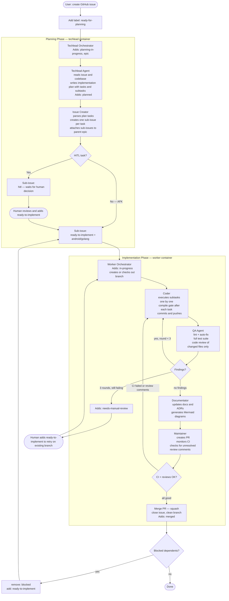

## The Itch

I've always liked playing with scripts, CI, and automating things. But this time, with LLMs, I think I outdid myself. 

I built a workflow that starts as a Telegram chat, which helps me shape the specs for a feature that launches as a GitHub issue. From there, I use a Docker image for planning changes, implementing code, running reviews, and merging code when quality gates and the CI build pass. And then CI releases a new version, but this is the boring part.

I had an unhealthy amount of fun connecting all those things together, and I still am tweaking it to my liking. I know there are out-of-the-box agent systems that just pick your prompt and plan work on a kanban board, use worktrees for parallel development, and generate specs using one of the frameworks (what a bold name for a markdown file). I tried some and didn’t like it. It was burning tokens to provide a generic experience, with the same approach to a TypeScript backend app, React frontend, native mobile, and GoLang.

So I made my own system, and I want to showcase my process.

Like every good automation, it begins with the itch. Some repetitive boring task, something I don't want to do, but I like when it's done, and I hate remembering about it. Like washing dishes. Or bumping the version number before app release so it's not failing after CI builds the Android app, runs tests and lint, pushes to store, and is rejected on the last step of deploy without notifying me. That kind of itch.
I am one of those maniacs who would spend half a day writing a script, saving me 3 minutes of work, or better, the need to remember some step in the process. And now I don't have to spend that time scripting; I have LLMs for it. And they even add cute Unicode icons in bash messages.

This post shows an AI-augmented development maturation process, an important journey. You may just jump to the last chapters, but you will miss the point.

---

## Stage 1: Like An Animal

It started with chatting with… chat to generate my code, fix a function I pasted into the text input, or generate SQL based on the DB schema I had to provide. Like an animal, coping from IDE into the browser and back.
But it showed me the power of this tool. Now I didn’t have to spend days debugging something silly, drowning in tutorial hell, and stack overflow posts just to move forward with my task.

The project I am currently working on with LLMs is my pet Android app with a Golang backend. I made the core of the app the good old-fashioned way, manually typing. Craft code produced from craft beer and craft pizza. 

Then they started plugging LLMs. I had a blueprint of how I wanted things to be, so ChatGPT could generate me something similar. I hate writing the same boilerplate over and over - this is why I tend to overengineer :)
This was before Claude Code; there was no real way for LLMs to interact with code. The IDE LLMs were useless for anything other than inline code generation.

It proved to be… okish at best, and the experience of coping and pasting was bad. It showed value for product discussions. What features go to MVP, what is nice to have, and what is a distinguishing factor for the app? You know, the type of stuff product managers are supposed to do.

---

## Stage 2: LLM in the IDE

The next stage is to use LLMs directly in an IDE. I started with Cursor, then tried Windsurf, but went back to Cursor. The LLM chat is now in my work environment, in a dedicated tab. I could link files or code snippets into the conversation, instead of copying and pasting them. 

I built an [iOS app](https://apps.apple.com/pl/app/candle-studio/id6752621480) then, without knowing Swift or anything about iOS development. I had to have  Xcode on the side to run code and fix compilation errors because Cursor couldn’t do it. The model was also far from what we have now (early 2026), but I learned how to use it. Make very precise, concrete instructions, set boundaries. [Read more](/2022-10-12-candle-studio-story)

I also learned what rulesets are, and that they don’t guarantee anything. They are a kind suggestion and a friendly reminder to the LLM, not an absolute law. But it was a breakthrough: I could unify rules across conversations, I didn’t have to tell the whole story to the LLM each time, like when calling the bank with a minor issue and going through 10 consultants.

I repurposed an iPad as a 3rd screen, just to have a window for LLM interaction below my code and browser, or notes on the other 2 screens.

I was moving way faster. Since I had the boilerplate, I could just ask it to generate another UseCase, ViewModel, bind them together, and move to the next feature.
But switching between Cursor and Xcode, or Android Studio, was still annoying. I used Cursor to generate code, and another IDE to run it in an emulator and debug it.

---

## Stage 3: Claude Code

Then came our lord and savior, Claude Code from Anthropic. A terminal tool. In 2026. Not sure if it's the ongoing nostalgia-vintage trend or people realizing Terminal and Vim are actually cool, but it was spot-on for what I needed.

It's counterintuitive, but having a dedicated terminal tool instead of relying on an IDE is way more comfortable. I could use my favourite IDE for the project: Android Studio or Xcode for mobile apps, IntelliJ IDEA for anything else, or, hell, even Neovim when I feel adventurous. And still have the same AI helper, with the same setup, right next to it. I could even use a terminal tab in an IDE and have Claude Code there, without any plugins.

I noticed I keep asking the LLM to do the same things over and over, like updating docs, building an app, running a linter, etc. People started sharing their prompts like they were the new libraries. Tools for tools. We can persist reusable prompts in the Claude config, globally or per project. We got MCPs that communicate with the outside world, like pulling language or library documentation. Specification generation frameworks started to pop up.

---

## Stage 4: Skills and Context Hygiene

All those Claude tools, plugins, and MCPs are awesome. But swallow context and tokens like my dog does a half-rotten sandwich he finds in the bushes.

The context window available for a single interaction was often way too small. No chance of generating a whole SaaS in one go, after a single sentence of description. Work had to be divided into scoped chunks, the output of each serving as input to the next phase. Like human-centipede or UNIX philosophy tools.

The bigger shift, for my workflow at least, was Skills and Commands. I could have a CLI or a script that I used before LLMs, and wrap it in an .md file that Claude could understand and use. Make small tools that work together, but this time semi-automated.

I had to learn how to maintain context hygiene. It was pointless to ask Claude to develop a full feature in one go. My project was already too big and complex. I had to create specs.md (with a Skill checking project docs), split it into tasks.md file (also using Skill, but looking into the actual code). Then, in another interaction, Claude completed the tasks. This allowed me to reset the interaction when needed and pick up the work where it had been left off.
But it still took a lot of manual work. The itch is back. I can do better.

I created skills for running tests, because I was too lazy to run commands in the terminal. Same for bumping app version and committing a new release tag, so the CI runs the release workflow and pushes the new app to the store. I used to have bash/python scripts for that; now I have a markdown file with a list of CLI example calls, and the LLM figures out how to use them.

But it doesn’t end there; I built a code review tool based on patterns and rules extracted from the project, with some generic good practices I reviewed. It runs locally before pushing code; it's good to find nitpicks and minor issues, so human reviewers can focus on what is most important - arguing about variable names.

Later, I added more tools and skills, and the workflow required running tests and compilation before marking the task as done and moving to the next one.

I discovered cheaper models like GLM for 6usd gave me 3x more usage than Claude code for 18usd - but it was dumber. Opencode, which was not causing epileptic seizures and had some nice features, such as displaying context usage or a list of tasks the LLM was performing.

I was using Claude for planning features, generating tasks, and reviewing its output manually. Then, using OpenCode with GLM to implement those tasks, following a strict workflow.

Why am I orchestrating this?

---

## Stage 5: Agents and the Workflow

Often, a single interaction was still too small to finish all the tasks on the list. The specification and task files are verbose; the coding interaction involved reading code and other project docs, running tests, and compiling code while reading terminal output. I initially was doing all those steps in a single interaction. Creating spec.md and tasks.md was a simple way to share important context between LLM interactions. But it still required some manual labor, and I’m not a fan of it. 

Here come the agents. Agent is another way to make the .md file the center of attention. But this time, it works in its own LLM interaction, with its own dedicated context window, not as part of the main interaction, like using skills or commands would.

Using my skills as a blueprint, I created some agents and organized them into a workflow. Agents themselves are not that different from skills; they just run in their own context window. But having a workflow (well, it's a Skill technically…) that calls those agents in order and orchestrates them means I can fire and forget. I can focus on writing the initial specification, then polishing it with the first agent. After it's approved, the whole machine starts, tasks are created, code is written, QA is performed, documentation is updated, a PR is created, and merged after successful CI validations.

I don’t use .md files to pass specs or tasks anymore. I switched to GitHub issues, which are easily accessible via the CLI (and a Skill to handle them), so agents can read and update issue descriptions, labels, and status.

I made an analyst-techlead Skill that checked that I was on the main branch, gathered my spec input, asked clarifying questions, checked the code for the implementation plan, and then created a GitHub issue with gh-cli. Later, I called another Skill to pick up the issue and start implementing.

Why do I need to do this manual labor in the middle? If only I could mark the issue as “ready to implement” and have some bot pick it up…

Hold my beer.

---

## The Factory

I wanted to be able to literally sit on a toilet and work on new feature specs instead of doomscrolling. It will be useful soon, as I am expecting my first kid, so I won't have time to work after work.

Here's the part where a Telegram message becomes a merged PR without me touching a keyboard.

I used a Telegram bot that pushes messages to a standalone n8n instance, running on my sandbox VPS Docker. It picks a message and routes it to one of several workflows, including the specs creation workflow. I have an LLM integration with GLM, Redis for local storage, and a GitHub connection for project documentation. The LLM is not working as a chat but as a set of one-off messages; this is why I need to manually keep memory in Redis, and it resets after an issue is created or manually, with a bot command. The LLM is prompted with a set of instructions, uses my project docs and conversation history to clarify the task, and, in the end, calls GitHub to create an issue with a comprehensive set of requirements.

I approve these specs by adding a label “ready-to-plan.” Another Docker container running on my home QNAP NAS (the VPS was not powerful enough) will pick them up, use the same prompt I was using locally to take the specs and generate tasks, then create subissues for the main task. It follows my work style and the workflow I established for this project. It almost works :) I am still tweaking here and there. I call it a techlead agent.

There is also a worker agent. It will pick up sub-issues raised by the tech lead that are relatively small and simple to implement. The Techlead is supposed to create issues that junior to mid-level developers can work on independently. The agent's independence is key here. I don’t want to pay too much, as I am a proud citizen of Poznań City. I still use just a 6usd GLM legacy plan subscription.

The worker agent is more complex, but it works on a simple task, so it's OK. After implementation is complete, a QA subagent runs linters, tests, checks code style, etc. If issues are found, it goes back to the coder to fix it - like in real life :) If I have to suffer, why shouldn't LLMs?
After QA is happy with the code, documentation is updated if needed, and the Maintainer creates a PR with a clear title and description that follows the rules. Then it periodically checks whether CI passes; my old-fashioned automation is the last line of defense, and it merges the PR.

My last interaction with this workflow is accepting the specification, the one I wrote while contemplating life in a solitary place.

The synchronization point is GitHub issues, specifically issue labels. When an agent picks a task, it changes its labels to reflect this. I even had a few instances where those containers were running multiple tasks simultaneously. The implementation there is ridiculously simple: it's a Linux image running an infinite-loop script that checks every minute for issues with a specific label. If there are any, it picks the first and fires the master agent, which then uses sub-agents in opencode with bypassed permissions. I don't use API calls, just my subscription, like I was using on my local machine :) I use the same, or very similar, agents, skills, tools, etc. 

Everything was slowly evolving, rather than me jumping from tool to tool. And the workflow is the one I made for myself, one I know and understand, and it's crafted for this particular project.

Yes, I know [Stripe has a similar setup with Slack and Minions](https://stripe.dev/blog/minions-stripes-one-shot-end-to-end-coding-agents), but I haven’t read the post yet. I was busy building this:

---

## Lessons From the Factory Floor

I wonder if I landed on the scrum team layout with automated agents because it is the best solution, or the only one I know?

I just merged a 10k lines of code pull request made with my agents, and it was way too much for my taste :) It works, and most of the code was standard HTTP client boilerplate with DTOs, api spec, some documentation, and 3 simple screens.

On the other hand, Techlead can create tasks that are way too granular. Once, the whole issue was about adding a single DTO, and a QA agent requested tests for it. So the Coder agent wrote a test for a bloody data transfer object.

The agents often get stuck on something, and since they run in Docker containers, I don’t have any visibility into what they are doing. Their only reporting place is GitHub issues, comments, and labels. 

I constantly iterate on minor changes to the workflow. Last update was better handling for blocked and already started issues, or picking the lowest issue number first - I had a situation where implementation started from updating docs, before any implementation was done :)

I enjoy the independence from vendors or tools. I can switch models as I want, use one for the Techlead and a different one for coding or QA. Add or remove steps, change workflow to fit my needs. And I use hardware and subscriptions I already had. I just put them into the OpenSpace cubicles and said - You are a team now.

I had an unhealthy amount of fun working on this automation, and it works well for me. Right now, I am on a train writing this post, while my workers are implementing small tasks created by the Techlead agent, based on the spec I wrote while pretending to listen to my wife :)

It would seem that, as in traditional software development, the more work done before coding, the better the long-term result. Who would have thought?

I wouldn’t trust code generated by an LLM if I didn't understand the whole process, and it would be the result of a single-line feature description. But I worked my way up to this point, and I know that after accepting specs, even a dumb model will not surprise me, because the task it gets is small and simple.
Splitting the project into multiple steps, tweaking each one independently, and creating quality gates makes me sleep well while my coding workers push the buttons, in the factory I build.

PS. Waking up to 20 messages on the Telegram bot about new issues and pull request updates, with agents working overnight, is a bit creepy.

